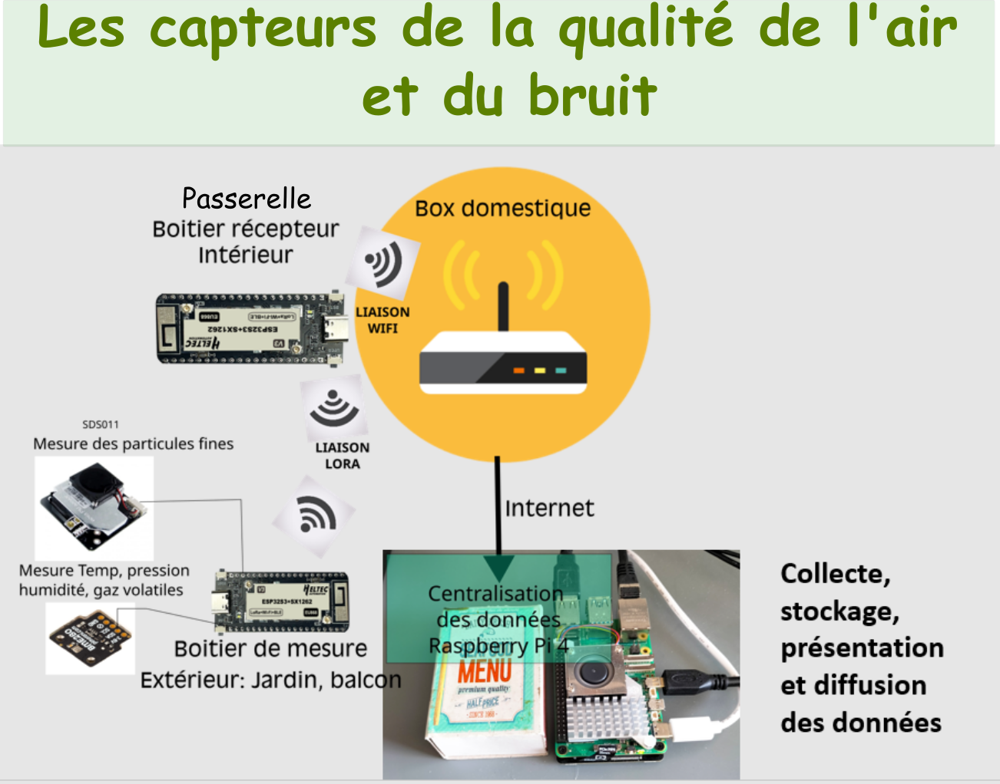
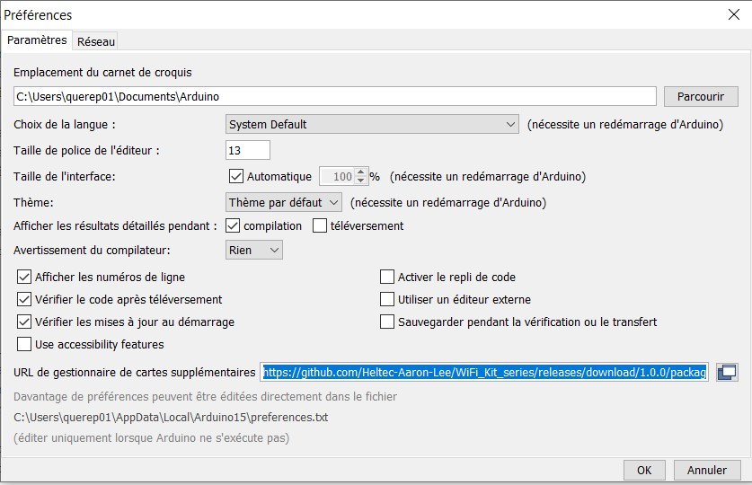

# Architecture du projet AQOR
## Présentation du projet
Le projet AQOR de mesure de la qualité de l'air et du bruit est organisé autour de capteurs fonctionnant sur batterie communiquant en protocole LORA avec une passerelle LORA-->Wifi permettant d'envoyer les mesures à un centre de collecte et de diffusion. Le projet comprend donc des aspects de fabircation du matériel et de développement du logiciel associé. Ces différents points sont abordés sur dépôt

### Architecture matérielle

 Le logiciel du projet AQOR a été développé en 3 parties distinctes qui reflètent l’architecture matérielle montrée ici:
 

#### Cartes électroniques pour le capteur 
L'électronique du capteur extérieur repose sur 3 cartes électronique dont les PCB réalisés avec KiCAD sont donnés dans les répertoires 
- pour la carte processeur: [Carte_Processeur](https://github.com/atena-aqor/aqor-s/tree/main/AQOR_Carte_Capteurs)
- pour la carte supportant les capteurs BME80 et INMP441 [Carte BME680/INMP441](https://github.com/atena-aqor/aqor-s/tree/main/AQOR_Carte_processeur)
Les cartes ont été développées avec le logiciel libre KiCAD en version 7.0

#### Boîtiers à imprimer
Les fichiers .STL pour l'impression 3D des boitiers sont donnés dans le répertoire: [Boitiers](https://github.com/atena-aqor/aqor-s/tree/main/AQOR%20STL)

### Architecture logicielle

Elle comprend:
- Un programme implanté dans le boîtier Emetteur qui fonctionne sur batterie
- Un programme implanté dans le boîtier Passerelle qui est connecté en WiFi à la box internet de l’hébergeur 
- Un logiciel Open Source de collecte et de diffusion des données implanté sur un micro-ordinateur Raspberry Pi5 fonctionnant sous linux UBUNTU. 

Les codes sources des programmes d'**émission** et de **passerelle** sont décrits dans les répertoires correspondants. Les fichiers Readme.md de chaque répertoire permettent de connaître le rôle de chaque fichier 

### Compilation des fichiers arduino 

Les fichiers proposés sont compilables sur la version de l'IDE Arduino 1.8.19 dont il faut choisir les préférences indiquées dans la figure suivante 

le lien exact surligné en bleu  est [https://github.com/Heltec-Aaron-Lee/WiFi_Kit_series/releases/download/1.0.0/package_heltec_esp32_index.json](https://github.com/Heltec-Aaron-Lee/WiFi_Kit_series/releases/download/1.0.0/package_heltec_esp32_index.json)
